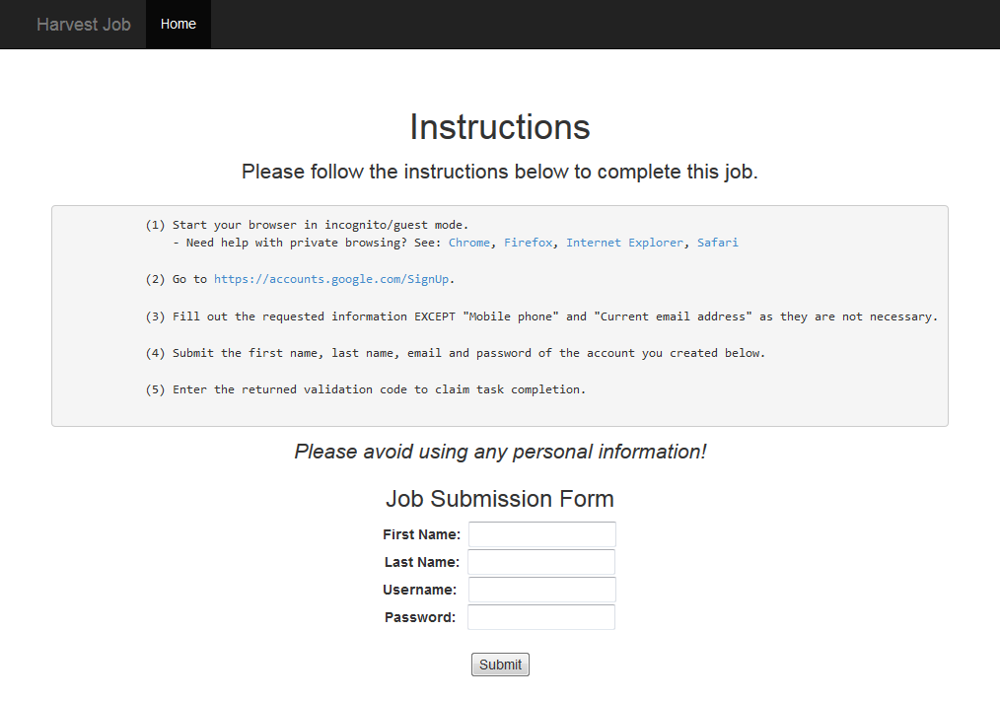

# Account Harvester
The repository contains source to a web application for crowd-sourcing the job of harvesting and validating Google account credentials.

**No responsibility is taken for an actions taken with this code.**

This application is designed for a service like [Amazon's Mechanical Turk](https://www.mturk.com/mturk/welcome) to crowd source the creation of Google accounts.  Upon submission of a completed job the web application validates the account credentials by sending a test email to a disposable email service [https://www.sharklasers.com](https://www.sharklasers.com/).  If the test email was successfully sent the account credentials are stored to the database along with a unique code that is returned to the job completed to claim that task's completion.  Additional logic could be added to change the account password after validation as an added security measure, but is currently not implemented.

**Note that while a similar job was posted on Amazon for the [Playdrone research project](https://github.com/nviennot/playdrone), according to Amazon's current terms of use this application would in violation of the policy and subject to being banned.**

To deploy, upload the source of this repository to a web server running PHP.  Create a MySQL database and edit the database connection settings at the top of the `credentials.php` file.

